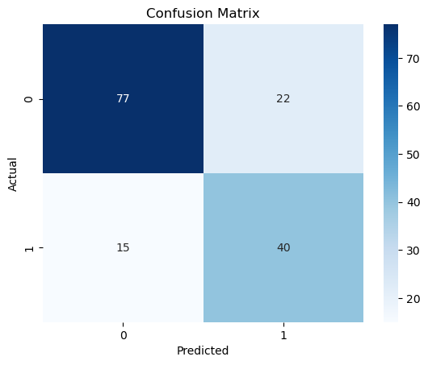

# 🩺 Diabetes Prediction App

  

---

## **Project Overview**
The Diabetes Prediction App is a **Machine Learning web application** that predicts the likelihood of diabetes based on clinical measurements like glucose level, blood pressure, BMI, and age.  

This project demonstrates:
- Data preprocessing and handling missing/outlier values.
- Feature scaling using **StandardScaler**.
- Model training with **Random Forest Classifier**.
- Evaluation with accuracy, confusion matrix, and classification report.
- Deployment via **Streamlit** for easy web interface.

---

## **Dataset**
The app uses a tabular dataset with the following features:

| Feature           | Description                              |
|------------------|------------------------------------------|
| Pregnancies       | Number of times pregnant                  |
| Glucose           | Plasma glucose concentration              |
| BloodPressure     | Diastolic blood pressure                  |
| SkinThickness     | Triceps skin fold thickness               |
| Insulin           | 2-Hour serum insulin                      |
| BMI               | Body mass index                           |
| DiabetesPedigree  | Diabetes pedigree function                |
| Age               | Age in years                              |
| Outcome           | 0: Non-diabetic, 1: Diabetic             |

> **Source:** [Kaggle Pima Indians Diabetes Dataset](https://www.kaggle.com/uciml/pima-indians-diabetes-database)

---

## **Installation**

**1. Clone the repository:**
```bash
git clone https://github.com/ravindidhananjana/diabetes-prediction.git

cd diabetes-prediction
```

**2. (Optional) Create and activate a virtual environment:**

```bash

conda create -n diabetes_env python=3.9
conda activate diabetes_env
```

**3. Install dependencies:**

```bash

pip install -r requirements.txt

```
## **Usage**

Run the Streamlit app:

```bash

streamlit run app.py

```
1.Enter patient data in the form

2.Click Predict to see the model’s output

The app also displays the model’s confidence score


## **Model Details**

**Model Used:** Random Forest Classifier

Note: Other models such as XGBoost, Logistic Regression, and KNN were also experimented with, but Random Forest gave the best results and is used in production.

**Hyperparameters:**
```bash
n_estimators = 200

min_samples_split = 10

min_samples_leaf = 1

class_weight = 'balanced'
```

Performance:
- Accuracy: ~75% on test data
- Evaluated using confusion matrix and classification report


Scaler: StandardScaler for feature normalization

##  Model Performance & Evaluation

The Random Forest model was evaluated on a held-out test set using healthcare-relevant metrics.

### Confusion Matrix
The confusion matrix below shows the trade-off between false positives and false negatives, which is critical in medical prediction tasks.



### Key Metrics
- Accuracy: ~75%
- Recall (Diabetic class): ~73%
- Precision (Diabetic class): ~65%

The model prioritizes detecting diabetic cases while maintaining a reasonable false positive rate, making it suitable as a screening support system.


## **Project Structure**


```bash

diabetes-prediction/
│
├─ app.py              # Streamlit web app
├─ rf_model.pkl        # Trained Random Forest model
├─ scaler.pkl          # Feature scaler
├─ diabetes.ipynb      # Model training & evaluation notebook
├─ requirements.txt    # Python dependencies
└─ README.md           # Project documentation
```
## **Future Improvements 🚀**

Hyperparameter tuning for better accuracy.

Testing additional ML models (XGBoost, SVM, Neural Networks).

User authentication and database integration.

Cloud deployment (Heroku, Streamlit Cloud, AWS).


## **Disclaimer ⚠️**

This project is developed for educational and demonstration purposes only.
It uses clinical features (like Glucose, Insulin, and SkinThickness) that are typically obtained from medical checkups or laboratory results.

The model is intended for healthcare professionals, researchers, or academic use, and should not be used for self-diagnosis or treatment.
Its purpose is to demonstrate machine learning workflow and technical skills using healthcare data.

## **References**
## 📚 References

- [Kaggle: Pima Indians Diabetes Dataset](https://www.kaggle.com/uciml/pima-indians-diabetes-database)  
- [Scikit-learn Documentation](https://scikit-learn.org/stable/)  
- [Streamlit Documentation](https://docs.streamlit.io/)


